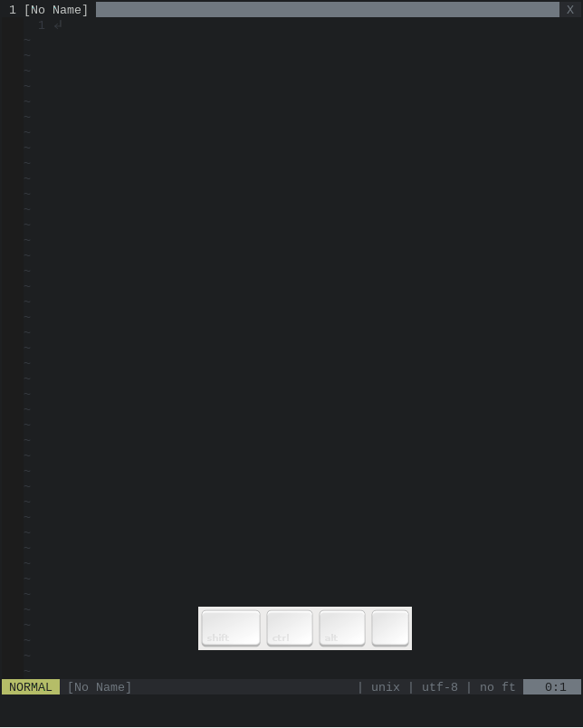
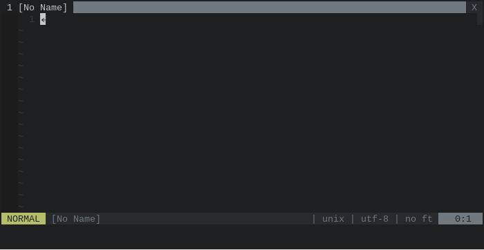
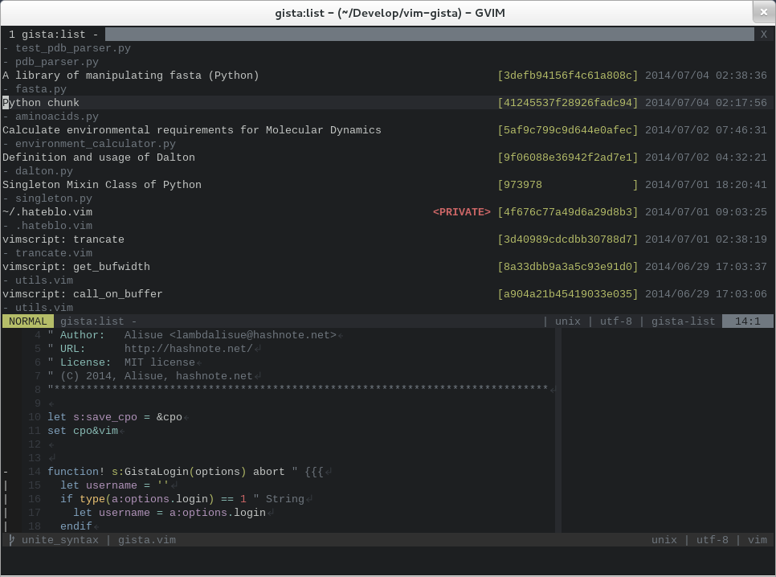

vim-gista
===============================================================================


Version: 0.1.6

*vim-gista* is a plugin for manipulating [Gists](https://gist.github.com/).
It provide the following features:

1. Listing gists
  - Authenticated user's gist entries
  - Authenticated user's starred gist entries
  - Gist entries of a particular user
  - Gist entries in Gist web
  - Listing gist entries in Unite (require '[Shougo/unite.vim](https://github.com/Shougo/unite.vim)')
2. Opening gists
  - Open files of an authenticated user in modifiable buffers
  - Open files of a particular user in nomodifiable buffers
  - Open files of a gist with a browser (require '[tyru/open-browser.vim](https://github.com/tyru/open-browser.vim)')
3. Posting gists
  - Create a new gist from a current buffer
  - Create a new gist from all opened+listed+visible buffers
4. Editing gists
  - A file content of a gist
  - A description of a gist
  - Rename a file of a gist
  - Remove a file of a gist
5. Deleting gists
6. Giving/taking a star to a gist
7. Forking a gist

The original concepts and strategies are taken from '[mattn/gist.vim](https://github.com/mattn/gist-vim)'; however the most of these are aggressively modified to establish vim-gista new implementations.


How to install
==============================================================================
First of all, vim-gista use '[cURL](http://curl.haxx.se)' or '[wget](https://www.gnu.org/software/wget)' to communicate with Gist API thus make sure that one of those commands is available in your system.

The [repository](https://github.com/lambdalisue/vim-gista) follow a standard vim plugin's directory structure thus you can use [Vundle.vim](https://github.com/gmarik/Vundle.vim) or [neobundle.vim](https://github.com/Shougo/neobundle.vim) to install vim-gista like:

```vim
" Vundle.vim
Plugin 'lambdalisue/vim-gista'

" neobundle.vim
NeoBundle 'lambdalisue/vim-gista'

" neobundle.vim (Lazy)
NeoBundleLazy 'lambdalisue/vim-gista', {
    \ 'autoload': {
    \    'commands': ['Gista'],
    \    'mappings': '<Plug>(gista-',
    \    'unite_sources': 'gista',
    \}}
```

Additionally, vim-gista require '[Shougo/unite.vim](https://github.com/Shougo/unite.vim)' and '[tyru/open-browser.vim](https://github.com/tyru/open-browser.vim)' to enable all features thus make sure that these plugins are loaded before the plugins like:

```vim
" Vundle.vim
Plugin 'Shougo/unite.vim'
Plugin 'tyru/open-browser.vim'
Plugin 'lambdalisue/vim-gista'

" neobundle.vim
NeoBundle 'lambdalisue/vim-gista', {
    \ 'depends': [
    \    'Shougo/unite.vim',
    \    'tyru/open-browser.vim',
    \]}

" neobundle.vim (Lazy)
NeoBundleLazy 'lambdalisue/vim-gista', {
    \ 'depends': [
    \    'Shougo/unite.vim',
    \    'tyru/open-browser.vim',
    \ ],
    \ 'autoload': {
    \    'commands': ['Gista'],
    \    'mappings': '<Plug>(gista-',
    \    'unite_sources': 'gista',
    \}}
```

If you are not using any vim plugin manager, you can copy the repository to your $VIM directory to enable the plugin but I really recommend you to try one of those vim plugin managers.

Once you installed vim-gista, specify your GitHub username to g:gista#github_user| variable like the code below. |vim-gista use that username in API authentication step.

```vim
let g:gista#github_user = 'your GitHub user name'
```

If nothing is specified to g:gista#github_user or g:github_user, vim-gista try to get your username from git profile ('github.user') thus you can specify your username in git command like:

```sh
$ git config --global github.user <your GitHub user name>
```

How to use
==============================================================================


Authentication
------------------------------------------------------------------------------


If you execute any vim-gista commands, functions, or mappings, vim-gista ask you to fill your GitHub password (or your GitHub username if you have not specified it yet) at first time.
The filled password will be used to create a new personal access token for vim-gista and the created personal access token is saved in your file system (the filled password will never be stored.)

If you prefer to specify a personal access token directory, call `:Gista --login` like below and input your personal access token as a username:

```vim
:Gista --login
```

If you want to temporary logout, call `:Gista --logout` without any arguments.
If you want to logout permanently, call the function with a argument like below:

```vim
:Gista --logout --permanently
```

If will delete a stored personal access token from your file system.


Listing
------------------------------------------------------------------------------


To list your public and private gist entries, run one of the following commands (short form or long form):

```vim
:Gista -l
:Gista --list
```

It will recursively download your gist entries at first time thus you may need to be really patient if you have tons of gists. The entries are cached and the cache will be used for rest of the processions. These cache will be updated automatically when there are any new or modified gists.

Once all your gist entries are downloaded, a buffer named 'gista:list' will be opened. You can manipulate your gists with following keys.

```vim
<F1>        :<C-u>help vim-gista-default-mappings<CR>
<C-l>       <Plug>(gista-action-update)
<C-l><C-l>  <Plug>(gista-action-update-nocache)
<CR>        <Plug>(gista-action-open)
<S-CR>      <Plug>(gista-action-browser)
+           <Plug>(gista-action-star)
-           <Plug>(gista-action-unstar)
?           <Plug>(gista-action-is-starred)
r           <Plug>(gista-action-rename)
D           <Plug>(gista-action-smart-delete)
F           <Plug>(gista-action-fork)
e           <Plug>(gista-action-edit)
s           <Plug>(gista-action-split)
v           <Plug>(gista-action-vsplit)
b           <Plug>(gista-action-browser)
```

If you want to list a particular user's gist entries, give the username to the command like:

```vim
:Gista -l lambdalisue
:Gista --list lambdalisue
```

If you specify 'starred' or 'public' like a username, you will see starred gist entries of your GitHub account or public gist entries in Gist web respectively:
Note: Public gist entries are not downloaded recursively and not cached, due to the amount of the gists.

```vim
:Gista -l starred
:Gista -l public
```

You can specify a particular page with '--page PAGE' option.
When the page is specified, gist entries existing in the page will be downloaded (and never be recursively downloaded and cached.)

```vim
    :Gista -l --page 2
```

If you want to refresh the gist entries (check update and download new or modified gist entries), hit <C-l> (<Plug>(gista-action-update)) on the 'gist:list' buffer.
If you want to re-build a cache of your gist entries, use '--nocache' option then all gist entries are recursively re-downloaded and the cache will be rebuilded by the new downloads.

```vim
    :Gista -l --nocache
```

Or hit <C-l><C-l> (<Plug>(gista-action-update-nocache)) on the 'gist:list' buffer.

Opening
------------------------------------------------------------------------------

If you want to open a gist on the 'gist:list' buffer, hit <CR> to open the gist with default opener.
If you want to specify the way to open the buffer, hit e, s, or v for 'edit', 'split', or 'vsplit' respectively.

If you are the owner of the gist, the gist will be opened in modifiable buffer, otherwise it will be opened in nomodifiable buffer.
The buffer will automatically be connected to the gist.
If a buffer is connected to a gist, you can get the gist informations with (the following functions are assumed to be used in statusline):

```vim
:echo gista#statusline#components#gistid()      " return Gist ID
:echo gista#statusline#components#filename()    " return filename
:echo gista#statusline#components#gistinfo()    " return both
```

Or if the buffer is modifiable, you can upload changes on the buffer with posting commands like:

```vim
" Short
:Gista
" Long
:Gista --post
" g:gista#update_on_write = 1
:w
" g:gista#update_on_write = 2
:w!
```

If you provide a new filename with :write command, the buffer will be disconnected from the gist and you will get a new local copy of the gist.

```vim
:w a_new_filename.txt
```

Or if you just want to disconnect, use the following command then the buffer will be liberate from the gist.

```vim
:Gista --disconnect
```

You can open a particular gist via Gist ID as well.
Provide a Gist ID with '--gistid' option and open the gist like:

```vim
    :Gista -o --gistid XXXXXXXXXX
    :Gista --open --gistid XXXXXXXX
```

Then all files in the gist will be opened with default opener.
If you want to open particular files, you can specify filenames with '--filename' option as a semi-colon separated filenames like:

```vim
:Gista -o --gistid XXXXXXXX --filename "A.txt;B.txt;C.txt"
```

Posting
------------------------------------------------------------------------------

If you want to create a new gist, execute one of the commands below. The commands will create a new gist with a content (or selected content) of a current buffer:

```vim
:Gista
:Gista --post
:'<.'>Gista
:'<.'>Gista --post
```

After you create a new gist, the current buffer will be connected to the gist.

If the current buffer is already connected to a gist or a Gist ID is written in the content (in 'GistID: XXXXXXXX' format) or is specified with '--gistid' option, the command will save changes rather than posting as a new gist.

If you want to specify a description in the command, use '-d' or '--description' option to specify:

```vim
:Gista -d "Description with a short option"
:Gista --description "Description with a long option"
```

If you want to specify a visibility, use '-p' or '--private' to make the gist private, use '-P' or '--public' to make the gist public (the default visibility is determined from the value of g:gista#post_private.
Note: Gist API does not provide a way to modify the visibility of an existing gist thus you cannot change the visibility of a gist in vim-gista interface.

```vim
:Gista -p -d "This is a private gist"
:Gista --private -d "This is a private gist"
:Gista -P -d "This is a public gist"
:Gista --public -d "This is a public gist"
```
If you want to update the gist as an anonymous gist, use '--anonymous' option

```vim
:Gista --anonymous
```

If you want to create a new gist with all opened buffer. Specify '--multiple' to the command like

```vim
:Gista --multiple
```

Again, if the gist ID is specified to the command, the command will post all
opened buffer to the specified gist (it will replace the content if a same
filename file exists on the gist).

vim-gista have much more features, check it out with

```vim
:help vim-gista-usage
```

With Unite.vim
-------------------------------------------------------------------------------


If you are using [Unite.vim](https://github.com/Shougo/unite.vim), you can manipulate gists with it.
The source name is 'gista' thus call the unite as follow:

```vim
:Unite gista
```

There are much more implementations, see with

```vim
:help vim-gista-unite-interface
```

Acknowledgments
===============================================================================
Without helps by members of [Lingr](http://lingr.com) vim-users.jp, this plugin cannot be built.
I would like to show my special thanks to them :-)

License
===============================================================================

Original gist.vim License
-------------------------------------------------------------------------------
LICENSE                                                     *gist-vim-license*


  Copyright 2010 by Yasuhiro Matsumoto
  modification, are permitted provided that the following conditions are met:
  
  1. Redistributions of source code must retain the above copyright notice,
     this list of conditions and the following disclaimer.
  2. Redistributions in binary form must reproduce the above copyright notice,
     this list of conditions and the following disclaimer in the documentation
     and/or other materials provided with the distribution.
  
  THIS SOFTWARE IS PROVIDED BY THE COPYRIGHT HOLDERS AND CONTRIBUTORS
  ``AS IS'' AND ANY EXPRESS OR IMPLIED WARRANTIES, INCLUDING, BUT NOT
  LIMITED TO, THE IMPLIED WARRANTIES OF MERCHANTABILITY AND FITNESS
  FOR A PARTICULAR PURPOSE ARE DISCLAIMED. IN NO EVENT SHALL THE
  REGENTS OR CONTRIBUTORS BE LIABLE FOR ANY DIRECT, INDIRECT,
  INCIDENTAL, SPECIAL, EXEMPLARY, OR CONSEQUENTIAL DAMAGES
  (INCLUDING, BUT NOT LIMITED TO, PROCUREMENT OF SUBSTITUTE GOODS OR
  SERVICES; LOSS OF USE, DATA, OR PROFITS; OR BUSINESS INTERRUPTION)
  HOWEVER CAUSED AND ON ANY THEORY OF LIABILITY, WHETHER IN CONTRACT,
  STRICT LIABILITY, OR TORT (INCLUDING NEGLIGENCE OR OTHERWISE)
  ARISING IN ANY WAY OUT OF THE USE OF THIS SOFTWARE, EVEN IF ADVISED
  OF THE POSSIBILITY OF SUCH DAMAGE.


vim-gista License
-------------------------------------------------------------------------------
The MIT License (MIT)

Copyright (c) 2014 Alisue, hashnote.net

Permission is hereby granted, free of charge, to any person obtaining a copy
of this software and associated documentation files (the "Software"), to deal
in the Software without restriction, including without limitation the rights
to use, copy, modify, merge, publish, distribute, sublicense, and/or sell
copies of the Software, and to permit persons to whom the Software is
furnished to do so, subject to the following conditions:

The above copyright notice and this permission notice shall be included in
all copies or substantial portions of the Software.

THE SOFTWARE IS PROVIDED "AS IS", WITHOUT WARRANTY OF ANY KIND, EXPRESS OR
IMPLIED, INCLUDING BUT NOT LIMITED TO THE WARRANTIES OF MERCHANTABILITY,
FITNESS FOR A PARTICULAR PURPOSE AND NONINFRINGEMENT. IN NO EVENT SHALL THE
AUTHORS OR COPYRIGHT HOLDERS BE LIABLE FOR ANY CLAIM, DAMAGES OR OTHER
LIABILITY, WHETHER IN AN ACTION OF CONTRACT, TORT OR OTHERWISE, ARISING FROM,
OUT OF OR IN CONNECTION WITH THE SOFTWARE OR THE USE OR OTHER DEALINGS IN
THE SOFTWARE.
